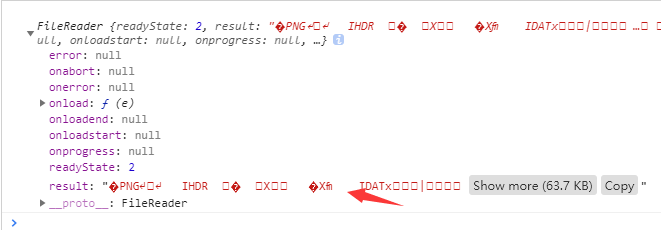

# nodejsbase64toimage
使用nodejs+express 写一个上传图片的接口，并且返回路径

遇到的问题：1.上传图片乱码问题 

	let render = new FileReader() 
	render.onload = function(e){
          console.log(this.result)
     }
    render.readAsText(file); //乱码
	使用 render.readAsDataURL(file)  代替

2.nodejs 返回图片路径问题

	var base64Data = req.body.imgData.replace(/^data:image\/\w+;base64,/, "");
	使用 var dataBuffer = new Buffer(base64Data, 'base64'); //报错

(**node:13424) [DEP0005] DeprecationWarning: Buffer() is deprecated due to security and usability issues. Please use the Buffer.alloc(), Buffer.allocUnsafe(), or Buffer.from() methods instead.**

	 var dataBuffer = Buffer.from(base64Data, 'base64'); //替换上面代码

3.上传文件太大问题（待解决，时间关系，来不及解决）

**PayloadTooLargeError: request entity too large**

4.fs.writeFile(`./static/img/${time}.png`, dataBuffer, function(err) {})  写入文件的时候，若文件夹没有，则报错，需要在static下面创建img 文件夹